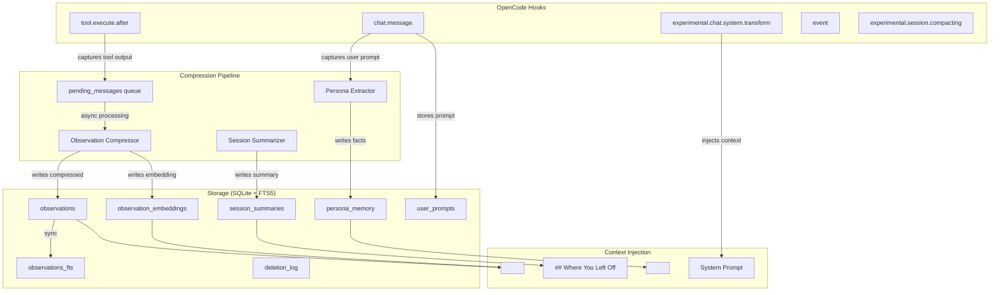

# opencode-memory-plugin

Persistent cross-session memory plugin for OpenCode, designed as a port of claude-mem to OpenCode according to the DAQ in this repository.

Contents
- [Install](#install)
- [Features](#features)
- [Tools](#tools)
  - [Memory Tools](#memory-tools)
  - [Persona Tools](#persona-tools)
- [Context Injection Structure](#context-injection-structure)
- [Compression Model](#compression-model)
- [Configuration](#configuration)
  - [Config Reference](#config-reference)
- [Worktree Support](#worktree-support)
- [Development](#development)
- [Notes](#notes)
- [Architecture](#architecture)

## Install

Add in `opencode.json`:

```json
{
  "$schema": "https://opencode.ai/config.json",
  "plugin": ["opencode-memory-plugin@latest"]
}
```

## Features

- Local persistence in SQLite with FTS5 index
- Hybrid-ready architecture for `FTS5 + sqlite-vec` (falls back to JS semantic search when native vector loading unavailable)
- Crash-safe pending queue for tool outputs
- Async AI compression pipeline (in-process)
- Observation quality system (high/medium/low) with raw fallback for low-quality entries
- Session summaries with structured fields (requested/investigated/learned/completed/next steps)
- Global persona memory (cross-project user preferences, auto-learned)
- Git worktree detection with multi-project memory queries
- Prior session continuity ("Where You Left Off" context block)
- Token economics display (compression savings in context header)
- LGPD-compliant deletion audit trail

## Tools

### Memory Tools

| Tool | Description |
|------|-------------|
| `memory_search` | Hybrid search (FTS5 + semantic) with quality markers on low-quality results |
| `memory_timeline` | Browse memories chronologically with cursor pagination |
| `memory_get` | Fetch full details for specific observation IDs, including raw fallback |
| `memory_add` | Explicit agent-controlled persistence (always quality `high`) |
| `memory_forget` | Delete observations by criteria, with preview mode (`confirm=false`) and confirmation token |
| `memory_stats` | Observability: counts, quality distribution, tool usage, DB size, embedding coverage |

### Persona Tools

| Tool | Description |
|------|-------------|
| `memory_persona_get` | View the current global user persona |
| `memory_persona_update` | Replace the persona content entirely |
| `memory_persona_patch` | Append new facts to the existing persona |
| `memory_persona_clear` | Clear the global user persona memory |

The persona is automatically learned from user messages (every 3 turns) and injected as `<persona_context>` before project memory in the system prompt.

## Context Injection Structure

On the first message of each session, the plugin injects a structured context block via `experimental.chat.system.transform`:

```
<persona_context>
## User Persona (learned from previous interactions)
...
</persona_context>

## Where You Left Off
**Completed:** ...
**Learned:** ...
**Next steps:** ...

<memory_context>
## Memory Status
📊 679 observations | 💾 79% compression savings

## Recent Observation Index (N entries)
- [id] title — subtitle (type, relative time)
...

## Detailed Recent Observations
...

## Semantically Relevant Observations
...

## Recent Session Summaries
...

## Available Memory Tools
...
</memory_context>
```

The "Where You Left Off" block uses the most recent prior session summary to provide continuity across sessions. It only appears when a previous session's summary has completed/learned/next_steps fields populated.

## Compression Model

The plugin does not hardcode a model. The compression model is resolved with this priority:

1. `OPENCODE_MEMORY_COMPRESSION_MODEL` env var or `compressionModel` in config JSON
2. `small_model` from OpenCode's runtime config
3. `model` from OpenCode's runtime config
4. If none configured, uses `SessionPromptObservationCompressor` which creates ephemeral hidden sessions via the OpenCode SDK, inheriting whatever provider and model the user has configured

In practice, **with no explicit config, compression uses the same model the user already has configured in OpenCode**.

## Configuration

You can provide plugin-specific config files in any of these paths:

- `~/.config/opencode/memory/config.json`
- `~/.config/opencode/memory/config.jsonc`
- `.opencode/memory.json`
- `.opencode/memory.jsonc`
- `opencode-memory.json`
- `opencode-memory.jsonc`

Or set `OPENCODE_MEMORY_CONFIG=/absolute/path/to/config.json`.

### Config Reference

```json
{
  "dbPath": "~/.config/opencode/memory/memory.db",
  "indexSize": 50,
  "sampleSize": 5,
  "maxPendingRetries": 3,
  "compressionModel": null,
  "maxRawContentSize": 50000,
  "privacyStrip": true,
  "enableSemanticSearch": true,
  "embeddingModel": "Xenova/all-MiniLM-L6-v2",
  "embeddingDimensions": 384,
  "semanticSearchMaxResults": 8,
  "semanticContextMaxResults": 3,
  "semanticMinScore": 0.55,
  "hybridSearchAlpha": 0.65,
  "minContentLength": 100,
  "compressionBatchSize": 10,
  "retentionDays": 90,
  "contextMaxTokens": 2000,
  "summaryLookback": 3,
  "orphanThresholdMs": 300000,
  "queuePollIntervalMs": 250,
  "sessionSummaryDebounceMs": 1500,
  "logLevel": "info"
}
```

| Option | Default | Description |
|--------|---------|-------------|
| `dbPath` | `~/.config/opencode/memory/memory.db` | SQLite database path |
| `indexSize` | `50` | Max observations in the context index |
| `sampleSize` | `5` | Max detailed observation samples in context |
| `maxPendingRetries` | `3` | Retry count for failed compression jobs |
| `compressionModel` | `null` | Override model for compression (see above) |
| `maxRawContentSize` | `50000` | Max raw tool output size before truncation |
| `privacyStrip` | `true` | Strip sensitive tokens (API keys, paths) |
| `enableSemanticSearch` | `true` | Enable local embedding + semantic search |
| `embeddingModel` | `Xenova/all-MiniLM-L6-v2` | HuggingFace model for local embeddings |
| `embeddingDimensions` | `384` | Embedding vector dimensions |
| `semanticSearchMaxResults` | `8` | Max results for `memory_search` semantic layer |
| `semanticContextMaxResults` | `3` | Max semantic results auto-injected in context |
| `semanticMinScore` | `0.55` | Minimum cosine similarity for semantic matches |
| `hybridSearchAlpha` | `0.65` | Weight for hybrid search (0=lexical, 1=semantic) |
| `compressionBatchSize` | `10` | Pending messages processed per batch |
| `retentionDays` | `90` | Days before observations are auto-deleted |
| `minContentLength` | `100` | Minimum tool output length to capture |
| `contextMaxTokens` | `2000` | Token budget for injected memory context |
| `summaryLookback` | `3` | Max session summaries included in context |
| `orphanThresholdMs` | `300000` | Pending message age before orphan recovery (5 min) |
| `queuePollIntervalMs` | `250` | Compression queue polling interval |
| `sessionSummaryDebounceMs` | `1500` | Debounce delay for session summary generation |
| `logLevel` | `info` | Log verbosity: debug/info/warn/error |

## Worktree Support

When the plugin detects a git worktree (`.git` is a file pointing to a parent repo), it queries observations and summaries from both the parent repo and the worktree project. This enables continuity when branching into a worktree — prior observations from `main` remain visible.

Detection uses `detectWorktree()` from `src/worktree.ts`, and multi-project queries use `getRecentObservationsMulti()` / `getRecentSummariesMulti()` from `MemoryStore`.

## Development

```bash
bun install
bun run typecheck
bun test
bun run build
```

## Notes

- This package targets OpenCode plugin APIs currently exposed by `@opencode-ai/plugin@1.2.x`.
- The architecture DAQ in `docs/DAQ-opencode-memory-plugin.md` is the source of truth for the hybrid rollout.
- All memory data is project-scoped. Persona memory is global (cross-project).
- The plugin never calls SDK APIs during initialization (avoids deadlock with the OpenCode HTTP server). SDK calls are safe inside hooks and pipeline methods.

## Architecture

